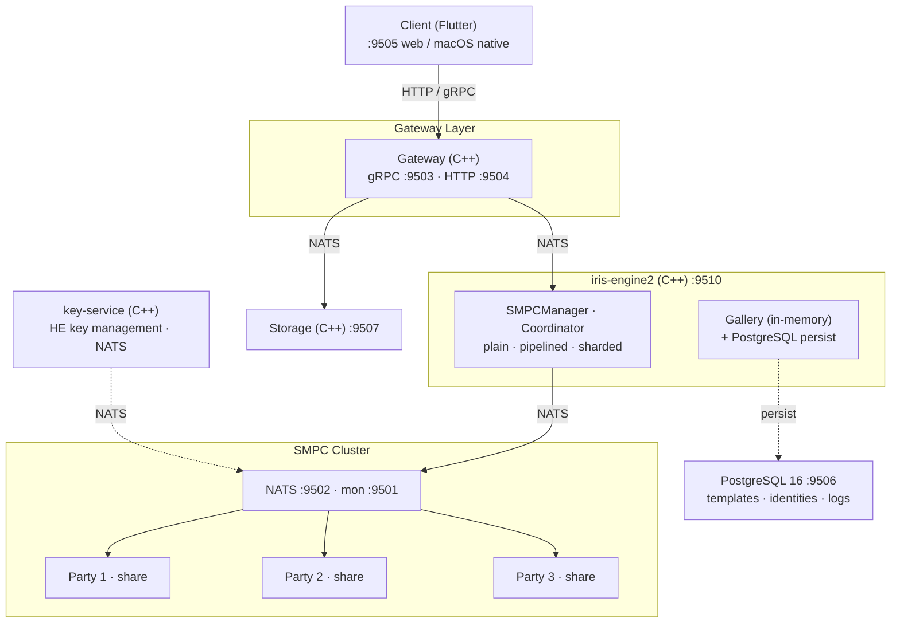
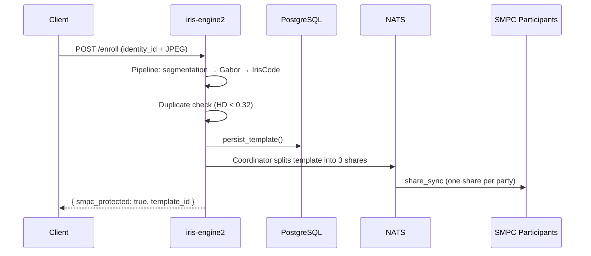
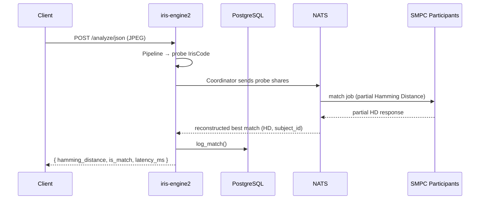

# EyeD — Iris Recognition Platform with Privacy-Preserving Matching

EyeD is a production-grade biometric identification system built around human iris recognition. It combines a high-performance C++ recognition engine, Secure Multi-Party Computation (SMPC) for privacy-preserving matching, and a fully containerized microservices architecture deployable with a single command.

---

## What It Does

EyeD captures iris images from cameras or devices, extracts a compact binary IrisCode using a Gabor filter bank pipeline, and matches it against an enrolled gallery using Hamming Distance. When SMPC is active, the matching computation is distributed across N (minimum 3) independent participants — no single participant sees a complete template, and the match result is mathematically identical to plaintext matching.

Templates are persisted in PostgreSQL for durability. On startup, existing templates are automatically re-enrolled into SMPC shares across the participant processes.

---

## Key Strengths

### 1. Privacy-Preserving Matching via SMPC
- Enrolled templates are **split into 3-party replicated secret shares** for all in-memory matching operations
- Hamming Distance is computed **across distributed participants** over NATS — no participant holds a complete template in memory
- A single compromised participant leaks nothing; reconstruction requires at least 2 parties
- SMPC match results are **mathematically identical to plaintext matching**, verified by 1,025 integration assertions covering 100 enrollment and verification pairs
- Three coordinator variants to suit different scale requirements:
  - **Plain coordinator** — synchronous, suitable for most deployments
  - **Pipelined coordinator** — async verification for higher throughput (`EYED_SMPC_PIPELINE_DEPTH`)
  - **Sharded coordinator** — hash-routed subjects across shard groups for large galleries (`EYED_SMPC_SHARDS_PER_PARTICIPANT`)
- **Simulated mode** runs all 3 parties in-process (no NATS, no containers) — identical cryptographic protocol, ideal for dev and testing

### 2. High-Performance C++23 Recognition Engine
- `iris-engine2` is written in C++23 using the `libiris` biometric library
- Full iris pipeline: ONNX semantic segmentation model → Binarization → Contouring → Normalization → Gabor filter bank (2 scales, 16×256 orientations) → Fragile Bit Refinement → IrisCode encoding
- Hamming Distance matching with ±15 rotation shifts for rotational invariance
- Match threshold: 0.39 HD (match); dedup threshold: 0.32 HD (duplicate)
- Thread-safe in-memory gallery with `std::mutex`-protected operations
- Mode-aware log levels: `prod` = warn-only, `dev` = debug, `test` = info

### 3. Security Hardening — All Opt-In
- **mTLS for NATS**: All coordinator↔participant communication can be secured with mutual TLS. `scripts/gen-certs.sh` generates a CA, coordinator cert, NATS cert, and per-party certs (4096-bit RSA, with Docker service SANs)
- **Audit logging**: Structured audit events for every enrollment and verification (and security violations) written to a configurable log path via `EYED_AUDIT_LOG_PATH`
- **Anomaly monitoring**: `SecurityMonitor` tracks per-service failure rates and latency; raises alerts on anomalies when `EYED_SECURITY_MONITOR=true`
- **Secure memory** (`secure_memory.h`): `explicit_bzero` wipe prevents compiler-optimized erasure; `mlock` prevents sensitive data from swapping to disk; `MADV_DONTDUMP` excludes regions from core dumps; RAII `LockedBuffer` ties lifecycle to scope
- **Docker secrets**: All database credentials are injected from Docker secret files — never from environment variable literals
- All security features default to **disabled** — zero impact on deployments that don't need them

### 4. Fault Tolerant and Resilient
- SMPC participant containers run with `restart: unless-stopped`
- The coordinator continues to operate through temporary participant restarts
- `EYED_SMPC_FALLBACK_PLAINTEXT=true` keeps the HTTP service alive and matching even if SMPC initialization fails, instead of hard-crashing
- Startup migration: `SMPCManager::migrate_templates()` re-enrolls all DB-loaded templates into SMPC shares on boot, with per-template success/failure tracking and timing

### 5. Fully Containerized, Multi-Mode Stack
- `make up` starts the entire system: iris-engine2, 3 SMPC participants, NATS, PostgreSQL, gateway, key-service, storage, and Flutter web client
- Three isolated operational modes (`prod`, `dev`, `test`) with separate databases — no cross-contamination of test and production data
- Compose overrides for webcam passthrough on both Linux (`/dev/video0`) and macOS (MJPEG relay host tool)
- All credentials managed via Docker secrets

### 6. Flutter Web + Native macOS Client
- `client2` is a Flutter application buildable as a **web app** (nginx-served) or a **native macOS application**
- Connects to the gateway for enrollment and identification workflows
- `fvm`-managed for reproducible Flutter SDK versions across machines

### 7. Iris Code Visualization
- `GET /gallery/template/:id` returns PNG-encoded visualizations of the stored IrisCode and mask (rendered at 512×128 pixels via OpenCV)
- Useful for debugging pipeline quality, validating segmentation, and visual inspection of enrolled templates

### 8. Comprehensive Automated Testing (10/10)
- All 10 test suites run inside Docker — no host toolchain required
- **1,025 assertions** in the SMPC integration suite alone, covering enrollment correctness, HD equivalence, unknown-subject rejection, share security, and edge cases
- Security test suite: 14 cases covering TLS context lifecycle, audit log events, `SecurityMonitor` anomaly detection, and `HealthCheckService` tracking
- Migration test suite: 7 cases verifying bulk re-enrollment, metadata-only add (no double-enrollment), rollback behavior, and plaintext fallback
- Distributed integration tests (`run-integration-tests.sh`): fault tolerance (kill/restart participant), 50 concurrent requests, P99 latency, TLS rejection

### 9. Production-Ready Operations
- Security gate `make verify-all` checks: route exposure in prod, config field filtering, DB isolation, log verbosity
- 40+ Makefile targets: start/stop/rebuild, per-service logs, NATS monitoring (`make nats-info`, `nats-conns`, `nats-subs`), gallery introspection, DB shell, training export, model download
- Health endpoint reports SMPC active state, DB connectivity, gallery size, and version

---

## Architecture



**Enrollment flow:**



**Verification flow:**



---

## Quick Start

**Prerequisites:** Docker, docker compose, `make`

```bash
# 1. Set up secrets (one time)
echo "eyed"      > secrets/db_user.txt
echo "eyed"      > secrets/db_name.txt
echo "eyed_e2"   > secrets/db_name_engine2.txt
echo "yourpass"  > secrets/db_password.txt

# 2. Download ONNX segmentation model
make download-models

# 3. Start the full stack
make up

# 4. Check readiness
make ready
```

Expected `/health/ready` response:
```json
{
  "alive": true,
  "ready": true,
  "smpc_active": true,
  "db_connected": true,
  "pipeline_loaded": true,
  "gallery_size": 0,
  "version": "0.1.0"
}
```

> **Note:** In `prod` mode, `GET /config` returns only `gallery_size`, `db_connected`, and `version`. Full SMPC config fields (`smpc_enabled`, `smpc_mode`, `smpc_active`) are visible in `dev` and `test` modes only.

---

## Service Ports

| Service       | Host Port | Description                            |
|---------------|-----------|----------------------------------------|
| iris-engine2  | 9510      | Iris recognition HTTP API              |
| gateway       | 9504      | HTTP health                            |
| gateway       | 9503      | gRPC (capture devices)                 |
| client2       | 9505      | Flutter web UI                         |
| storage       | 9507      | Archive HTTP health                    |
| NATS          | 9502      | Message bus                            |
| NATS monitor  | 9501      | HTTP monitoring dashboard              |
| PostgreSQL    | 9506      | Database                               |

---

## HTTP API (iris-engine2)

| Method   | Path                      | Description                                            |
|----------|---------------------------|--------------------------------------------------------|
| `GET`    | `/health/alive`           | Liveness — always 200 while process is running         |
| `GET`    | `/health/ready`           | SMPC status, DB, gallery size, version                 |
| `GET`    | `/config`                 | Operational config (field set filtered by mode)        |
| `POST`   | `/enroll`                 | Enroll identity from JPEG; returns `smpc_protected`    |
| `POST`   | `/analyze/json`           | Identify from JPEG; returns match + `latency_ms`       |
| `GET`    | `/gallery/size`           | Current gallery template count                         |
| `GET`    | `/gallery/list`           | List all enrolled identities and their template IDs    |
| `GET`    | `/gallery/template/:id`   | Template detail + IrisCode PNG visualization (512×128) |
| `DELETE` | `/gallery/delete/:id`     | Remove identity and all its templates                  |

---

## Operational Modes

| Mode   | SMPC default  | Database    | Log level | Use case                     |
|--------|---------------|-------------|-----------|------------------------------|
| `prod` | distributed   | `eyed`      | warn      | Production deployment        |
| `dev`  | simulated     | `eyed_dev`  | debug     | Local development            |
| `test` | simulated     | `eyed_test` | info      | Integration test isolation   |

---

## SMPC Configuration

| Variable                           | Default       | Description                                        |
|------------------------------------|---------------|----------------------------------------------------|
| `EYED_SMPC_ENABLED`                | `true`        | Enable SMPC for all matching operations            |
| `EYED_SMPC_MODE`                   | `distributed` | `simulated` (in-process) or `distributed` (NATS)   |
| `EYED_NATS_URL`                    | —             | NATS server URL, e.g. `nats://nats:4222`           |
| `EYED_SMPC_NUM_PARTIES`            | `3`           | Number of SMPC parties (must be 3)                 |
| `EYED_SMPC_PIPELINE_DEPTH`         | `0`           | `>0` enables pipelined async coordinator           |
| `EYED_SMPC_SHARDS_PER_PARTICIPANT` | `0`           | `>0` enables sharded coordinator for large galleries |
| `EYED_TLS_CERT_DIR`                | —             | mTLS cert directory (empty = TLS disabled)         |
| `EYED_AUDIT_LOG_PATH`              | —             | Structured audit log path (empty = disabled)       |
| `EYED_SECURITY_MONITOR`            | `false`       | Enable anomaly monitoring                          |
| `EYED_SMPC_FALLBACK_PLAINTEXT`     | `false`       | Stay alive with plaintext matching if SMPC fails   |

---

## Enabling mTLS

```bash
# Generate all certificates (CA, coordinator, NATS server, party-1/2/3)
./iris-engine2/scripts/gen-certs.sh ./iris-engine2/certs

# Set in docker-compose.yml or .env
EYED_TLS_CERT_DIR=/certs
SMPC_TLS_CERT_DIR=/certs
EYED_AUDIT_LOG_PATH=/var/log/smpc_audit.log
EYED_SECURITY_MONITOR=true

make down && make build && make up
```

---

## Testing

```bash
# Run all 10 test suites in Docker (no host deps required)
docker build --target test -t iris-engine2-test ./iris-engine2
docker run --rm iris-engine2-test ctest --test-dir /src/build --output-on-failure

# Run distributed integration + fault tolerance tests (requires live stack)
make up
./iris-engine2/scripts/run-integration-tests.sh

# Run security gate checks against live prod stack
make verify-all
```

| Suite                  | Cases | Assertions | What it covers                                      |
|------------------------|-------|------------|-----------------------------------------------------|
| test_config            | 20+   | —          | All env var parsing, secrets injection, defaults    |
| test_db                | 8+    | —          | PostgreSQL CRUD, template round-trip                |
| test_gallery           | 10+   | —          | add/match/remove, dedup threshold, SMPC sync        |
| test_smpc              | 12    | —          | SMPCManager init, simulated/distributed modes       |
| test_smpc_coordinator  | 8+    | —          | Coordinator enroll/verify, subject mapping          |
| test_smpc_sharded      | 6+    | —          | Sharded coordinator routing and gallery size        |
| test_smpc_security     | 14    | 33         | TLS lifecycle, audit events, SecurityMonitor, HealthCheck |
| test_smpc_integration  | 8     | 1,025      | Protocol correctness: enrollment, HD equivalence, share security |
| test_migration         | 7     | 32         | Bulk migrate, no double-enroll, rollback            |
| bench_smpc             | —     | —          | Throughput and latency benchmarks                   |

---

## Applications

EyeD's architecture makes it applicable across domains where accurate, fast, and privacy-conscious identity verification is required:

- **Physical Access Control** — Contactless entry for buildings, data centers, and restricted areas. SMPC means a compromised server does not expose enrolled identities.
- **Border Control & eGates** — High-throughput iris verification with latency tracking and match logging per frame.
- **Healthcare Identity** — Patient identification workflows. Separated databases per environment enforce data isolation from day one.
- **Financial Services** — Strong biometric authentication for KYC, high-value transactions, or account recovery.
- **Workforce Management** — Attendance, shift access, or secure logical access for sensitive roles.
- **Research & Development** — The simulated SMPC mode and configurable pipeline make it a safe, self-contained platform for iris algorithm research without network infrastructure.
- **Multi-Tenant Deployments** — Mode-isolated databases (`eyed`, `eyed_dev`, `eyed_test`) allow staging and production to share infrastructure without data bleed.

---

## Project Documents

| Document                | Description                                              |
|-------------------------|----------------------------------------------------------|
| `eyed-smpc.md`          | SMPC implementation plan (all 6 phases)                  |
| `eyed-smpc-vv.md`       | Verification & Validation procedures                     |
| `eyed-smpc-pentest.md`  | Penetration testing plan (25 test procedures)            |
| `iris-engine2.md`       | iris-engine2 architecture deep-dive                      |
| `MODERN_ARCHITECTURE.md`| Full system architecture reference                       |

---

## Makefile Quick Reference

```bash
make up              # Start all services (prod mode)
make up-dev          # Start in dev mode (simulated SMPC, debug logs)
make up-test         # Start in test mode (isolated test DB)
make down            # Stop all services
make build           # Build all Docker images
make rebuild         # Rebuild all without cache
make status          # Containers + health + gallery in one view
make ready           # Readiness check across all services
make health          # Liveness check across all services
make logs            # Follow all service logs
make nats-info       # NATS server stats
make nats-conns      # NATS active connections
make nats-subs       # NATS active subscriptions
make gallery         # Current gallery size
make db-shell        # Open PostgreSQL shell
make db-reset        # Drop and recreate schema
make verify-all      # Run all security gate checks (S1, S2, S3, S6)
make download-models # Download ONNX segmentation model
make test-iris-engine2-container  # Run C++ unit tests in container
```

---

## License

See `LICENSE` for terms.
